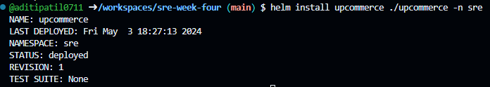

# Release Engineering at UpCommerce

## Deploy stable version (Minikube, Deployments and Service creation):

```
minikube start
kubectl create ns sre

helm install upcommerce ./upcommerce -n sre

```

 ### Confirm the deployment
```
kubectl get deployment -n sre
```
or check the pod
```
kubectl get po -n sre
```
## Create Canary Version:

canary-deployment.yml
```
apiVersion: apps/v1
kind: Deployment
metadata:
  name: {{ .Release.Name }}-canary-app
spec:
  replicas: {{ .Values.replicaCount }}
  selector:
    matchLabels:
      app: {{ .Release.Name }}-canary-app
  template:
    metadata:
      labels:
        app: {{ .Release.Name }}-canary-app
    spec:
      containers:
        - name: canary
          image: {{ .Values.canary.image }}
          ports:
            - containerPort: 5003
          imagePullPolicy: {{ .Values.imagePullPolicy }}
          resources:
            limits:
              cpu: {{ .Values.cpuLimit }}
              memory: {{ .Values.memoryLimit }}
```
canary-service.yml
```
apiVersion: v1
kind: Service
metadata:
  name: {{ .Release.Name }}-canary-service
spec:
  selector:
    app: {{ .Release.Name }}-canary-app
  ports:
    - protocol: TCP
      port: 5003
      targetPort: 5003
```
Add this deployment in values.yaml
```
canary:
  image: uonyeka/canary:linux-amd64
```

## Roll back to stable release

Check deployment
```
```

Or list the pod
```
```

List helm releases
```
```

## Confirm Rollback

```
```

```
```